# ⚙️ JIT vs. AOT Compilers & GPU target Selection

This guide answers how LLVM differentiates between running on your host processor (e.g., an Intel Core i9 CPU) versus an accelerator card (e.g., an NVIDIA GPU), and provides a deep architectural comparison of **Just-In-Time (JIT)** versus **Ahead-Of-Time (AOT)** compilation.

---

## 1. How Does LLVM Select: Core i9 CPU vs. NVIDIA GPU?

By default, the compiler you just built compiles and executes code **entirely on your Intel Core i9 CPU**. 

### How to Check the Current Target
In our codebase (`src/jit.cpp`), the compiler calls:
```cpp
InitializeNativeTarget();
InitializeNativeTargetAsmPrinter();
```
* `Native` tells LLVM to detect your host CPU (the exact computer running the compiler) and automatically set the **Target Triple** (e.g., `x86_64-pc-linux-gnu`).
* Therefore, the LLVM engine is actively compiling code into **Intel x86 machine instructions** and executing it directly in CPU threads.

### Why You Cannot "Directly JIT" into an NVIDIA GPU
A GPU is a **co-processor** with a completely different hardware paradigm:
* **The CPU** is designed for **low-latency sequential execution** (massive caches, aggressive out-of-order execution, complex branch prediction). It runs x86_64 or ARM assembly.
* **The GPU** is designed for **high-throughput parallel execution** (thousands of lightweight cores running SIMT—Single Instruction, Multiple Threads). It runs a target-specific GPU assembly (NVIDIA's **SASS**, compiled from virtual GPU assembly called **PTX**).
* You **cannot** execute a standard C++ function pointer jump (like `compiled_main()`) directly onto a GPU. The GPU has its own isolated memory (VRAM) and lacks direct access to the CPU's register state or stack frames.

```mermaid
graph TD
    subgraph CPU ["CPU Execution Pipeline (Intel i9)"]
        A[JIT Compiled RAM Page] -->|Direct Call| B[Host CPU Register / Stack]
        B -->|Executes x86_64| C[Result returned immediately]
    end

    subgraph GPU ["GPU Execution Pipeline (NVIDIA NVPTX)"]
        D[LLVM NVPTX Backend] -->|Compiles to| E[PTX Assembly Text]
        E -->|CUDA Driver API| F[Compile to SASS Binary]
        G[Host CPU RAM] -->|1. Allocate VRAM| H[Device VRAM]
        G -->|2. Memory Copy| H
        F -->|3. Launch Kernel| I[GPU Cores / Threads]
        I -->|4. Copy Back| G
    end
```



---

### How to Swap Targets and Compile to the NVIDIA GPU
To compile LLVM IR for an NVIDIA GPU, you must explicitly bypass the native host compiler and target the **NVPTX** backend. Here is the C++ code required to do this programmatically:

```cpp
#include "llvm/Support/TargetSelect.h"
#include "llvm/MC/TargetRegistry.h"
#include "llvm/Target/TargetMachine.h"

void CompileToNVIDIA(llvm::Module* module) {
    // 1. Initialize all backends (not just the host CPU backend)
    llvm::InitializeAllTargets();
    llvm::InitializeAllTargetMCs();
    llvm::InitializeAllAsmPrinters();

    // 2. Define the Target Triple for NVIDIA GPU (64-bit CUDA)
    std::string TargetTriple = "nvptx64-nvidia-cuda";
    module->setTargetTriple(TargetTriple);

    // 3. Look up the NVPTX target in the LLVM Registry
    std::string Error;
    const llvm::Target* Target = llvm::TargetRegistry::lookupTarget(TargetTriple, Error);
    if (!Target) {
        std::cerr << "Error finding NVPTX target: " << Error << std::endl;
        return;
    }

    // 4. Configure the GPU architecture (e.g., sm_80 for Ampere/A100, sm_89 for Ada Lovelace)
    std::string CPU = "sm_80"; 
    std::string Features = ""; // Optional attributes

    llvm::TargetOptions opt;
    auto RM = llvm::Optional<llvm::Reloc::Model>();
    
    // 5. Create the GPU Target Machine
    llvm::TargetMachine* TargetMachine = Target->createTargetMachine(
        TargetTriple, CPU, Features, opt, RM);

    module->setDataLayout(TargetMachine->createDataLayout());
    
    // The compiler can now emit standard NVIDIA PTX GPU assembly text!
}
```

To run this on the GPU, you would:
1. Write the compiled PTX string to a buffer.
2. Initialize the **NVIDIA CUDA Driver API** in C++ (`cuInit(0)`).
3. Load the PTX code into the driver (`cuModuleLoadData`).
4. Allocate VRAM on the GPU (`cudaMalloc` / `cuMemAlloc`).
5. Copy your input data to the GPU VRAM (`cudaMemcpy`).
6. Launch the compiled GPU kernel using `cuLaunchKernel`.
7. Retrieve the calculated outputs back to CPU RAM.

---

## 2. JIT vs. AOT: The Deep-Dive Comparison

| Aspect | Just-In-Time (JIT) Compilation | Ahead-Of-Time (AOT) Compilation |
| :--- | :--- | :--- |
| **Concept** | Compiles code on-the-fly *during* execution. | Compiles code *before* execution, outputting a static file. |
| **Common Examples** | Java Virtual Machine (JVM), V8 (JavaScript), PyPy (Python), and our `minicompiler`. | GCC, Clang (C/C++), rustc (Rust), Swift. |
| **Output File** | **None.** Code resides purely in ephemeral RAM pages. | **Binary File** on disk (`.elf`, `.exe`, `a.out`). |
| **Startup Cost** | **High.** The compilation overhead happens at program startup, causing "warm-up" lag. | **Zero.** The program is already fully compiled; execution starts instantly. |
| **Peak Execution Speed** | Can theoretically be **faster than AOT** via dynamic runtime profiling. | Highly optimized, but limited to static facts known at compile time. |
| **Memory Footprint** | **High.** Both the compiler library (LLVM) and the running application must sit in memory. | **Low.** Only the compiled application binary runs; the compiler is absent. |
| **Platform Portability** | **Extremely High.** You distribute platform-agnostic code (IR/bytecode). JIT adapts it to any machine. | **Low.** The binary is locked to a single ISA (x86_64, ARM) and OS kernel. |
| **Security Risk** | **Higher.** Requires dynamic writable-to-executable memory pages, opening vectors for exploit payloads. | **Lower.** Code pages are marked read-only and executable; easily protected by hardware DEP/W^X. |

---

## 3. Visual Execution Lifecycles

### Ahead-of-Time (AOT) Lifecycle

```
[ Developer Machine ]
Source Code -> [ Compiler (Clang/Rustc) ] -> LLVM IR -> [ Backend Optimizer ] -> Native Machine Code Binary (.exe/a.out)

[ End-User Machine ]
Double Click Binary -> OS loads binary into RAM -> CPU directly executes instructions at native speeds (Zero Compile Overhead)
```

### Just-in-Time (JIT) Lifecycle

```
[ Distribution ]
Source Code / Bytecode -> Delivered directly to End-User Machine

[ End-User Machine ]
Run Program -> JVM/JIT starts up in RAM -> Profiler monitors hot paths -> [ LLVM compiler engine compiles code in RAM ] -> CPU executes dynamically generated RAM page
```

---

## 4. Architectural Trade-offs: The Fine Print

### ⚡ Optimization: Profile-Guided Optimization (PGO) vs. Whole Program Optimization (WPO)
* **JIT Optimizations**: A JIT compiler has access to **runtime values**. 
  * *Example*: In JavaScript, if a function `add(a, b)` is *always* called with two integers at runtime, the JIT (V8) can optimize away all type-checking code and compile it down to a single CPU assembly instruction. If a string is passed later, it "de-optimizes" and recompiles.
  * JIT compilers use **Profile-Guided Optimization (PGO)** automatically during runtime.
* **AOT Optimizations**: An AOT compiler must be conservative because it has no idea what runtime values the user will pass.
  * It compensates for this using aggressive compile-time analyses like **Link-Time Optimization (LTO)** or **Whole-Program Optimization (WPO)** to inline code across different file boundaries and perform intensive vectorizations that would take too long to run at startup in a JIT.

### 🛡️ Security: The W^X (Write XOR Execute) Boundary
To prevent hackers from injecting malicious machine instructions into a running program and executing them, modern operating systems enforce **W^X**:
* **AOT** is incredibly secure. When your OS loads an ELF binary, it maps the code pages as `RX` (Read-Execute) and data pages as `RW` (Read-Write). A hacker cannot overwrite code pages because they are not writable, and they cannot execute injected data because data pages are not executable.
* **JIT** is a constant security battle. Because the JIT must *write* compiled code and then *execute* it, it must constantly toggle memory page permissions (`RW` -> `RX`). If a hacker exploits a buffer overflow during the compilation phase, they can hijack these executable pages, bypassing standard operating system defenses.
