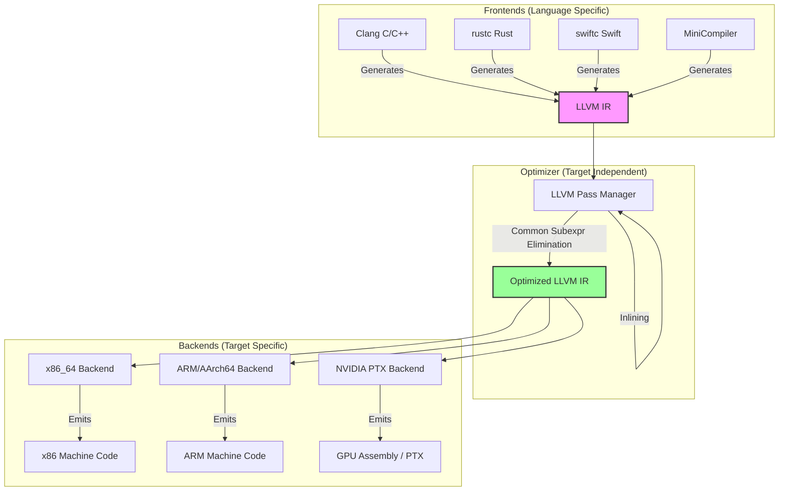
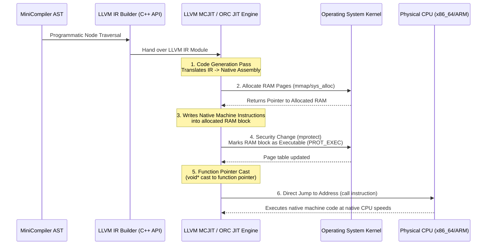

# 🐉 LLVM Architecture & Deep-Dive Guide

LLVM (originally Low Level Virtual Machine) is a collection of modular and reusable compiler and toolchain technologies. Rather than a single monolithic program, it is a suite of C++ libraries designed to make compiler optimization and code generation extremely efficient, flexible, and target-agnostic.

---

## 1. The Core LLVM Architecture

Historically, compilers were built as single, monolithic pipelines (e.g., early GCC versions). If you wanted to support a new programming language (frontend) or a new CPU architecture (backend), you had to write a brand-new compiler from scratch.

LLVM revolutionized this by introducing a **three-phase design**:



### The Three Phases:
1. **Frontend**: Parses source code, performs semantic analysis, and translates the high-level AST into **LLVM Intermediate Representation (IR)**.
2. **Optimizer**: A modular pipeline of target-independent optimization "passes". It takes LLVM IR as input, applies optimizations (like dead code elimination, inlining, and loop vectorization), and outputs optimized LLVM IR.
3. **Backend**: Translates the optimized LLVM IR into raw machine assembly / binary for a specific target hardware architecture (e.g., Intel/AMD x86, ARM, Apple Silicon, or NVIDIA GPUs).

---

## 2. What Language is LLVM Written In?

The entire LLVM framework is written in **modern, highly optimized C++**.

### Why C++?
* **Zero-Cost Abstractions**: High-level design patterns (like Polymorphism and templates) can be used without runtime performance penalties.
* **Low-Level Control**: Compilers need to directly manage memory, align data structures to CPU caches, and interact directly with OS-level memory systems.
* **Object-Oriented Design**: LLVM represents instructions, basic blocks, functions, and modules as class hierarchies (e.g., `llvm::Value`, `llvm::Instruction`, `llvm::Function`).
* **Extensibility**: Frontends (like Clang, Rustc, Swift, or our `MiniCompiler`) can link directly against these C++ dynamic/static libraries (`libLLVM.so` or `libLLVM.a`) and programmatically build programs using the C++ API (e.g., `llvm::IRBuilder`).

---

## 3. LLVM IR: Machine Independent or Target Dependent?

> [!IMPORTANT]
> LLVM IR is **mostly** target-independent, but not **completely**.

### Why it is "Machine Independent"
LLVM IR behaves like a universal assembly language with an **infinite register set** in **Static Single Assignment (SSA)** form. 
* A simple addition in LLVM IR looks identical whether you are targeting an Intel Core i9, an Apple M3, or an NVIDIA H100 GPU:
  ```llvm
  %res = add i32 %a, %b
  ```
* Because LLVM IR hides hardware details (like physical registers, CPU-specific pipeline details, and native calling conventions), the **LLVM Optimizer** can perform millions of generic optimizations (like `2 + 3` -> `5`) without knowing or caring what CPU will eventually execute the code.

### Where Target-Dependence Creeps In
While the instructions are target-agnostic, LLVM IR contains specific metadata that is **target-dependent**:
* **Pointer Sizes**: A 64-bit machine (x86_64) has 8-byte pointers, while a 32-bit embedded processor has 4-byte pointers. This changes struct offsets and memory allocation sizes in the IR.
* **Data Layout (`target datalayout`)**: Defines the endianness (little-endian vs. big-endian) and alignment requirements of data types on the target hardware.
* **Target Triple (`target triple`)**: Specifies the system architecture, vendor, and operating system (e.g., `x86_64-pc-linux-gnu` or `arm64-apple-macosx14.0.0`).

---

## 4. How Does JIT (Just-In-Time) Work?

A traditional compiler (Ahead-of-Time, or AOT) writes machine code to an executable file (like `a.out` or `.exe`) on disk. When you run our `minicompiler`, it does not write to disk. It compiles and runs code **directly in your computer's RAM** in microseconds.

Here is the exact step-by-step systems execution pipeline of how JIT works:



### The System-Level Mechanics of JIT:
1. **Memory Allocation**: The JIT engine uses OS system calls (like `mmap` on Linux/macOS or `VirtualAlloc` on Windows) to allocate a clean block of pages in your computer's physical RAM.
2. **Target Compilation**: The JIT queries your machine's CPU capabilities (e.g., checking if your x86 processor supports AVX instructions) and translates the LLVM IR directly into the binary CPU instructions matching your host architecture.
3. **Writing to RAM**: The compiler writes these binary machine instructions directly into the allocated RAM pages.
4. **The Security Handshake (`mprotect`)**: Modern OS kernels enforce strict security called **W^X (Write XOR Execute)**. A memory page can be writable, or executable, but *never both at the same time* (to prevent shellcode injection attacks).
   * Initially, the JIT page is **Writable** (`PROT_READ | PROT_WRITE`) so the JIT can write the machine code.
   * Once writing is finished, the JIT invokes `mprotect()` to strip write permissions and add **Executable** permissions (`PROT_READ | PROT_EXEC`).
5. **Dynamic Invocation**: The JIT casts the memory address of the entry point into a standard C++ function pointer:
   ```cpp
   typedef int (*MainFuncPtr)();
   MainFuncPtr compiled_main = (MainFuncPtr)symbol_address;
   ```
6. **Hardware Execution**: When you call `compiled_main()`, the CPU's Instruction Pointer register jumps directly to that address in RAM. The physical CPU executes these dynamic instructions at full native hardware speed, exactly like pre-compiled C++ code!

---

## 5. Summary Cheat Sheet for Systems & Compiler Interviews

| Question | Core Concept | Deep Interview-Level Insight |
| :--- | :--- | :--- |
| **Is LLVM an Interpreter or Compiler?** | Compiler Library | LLVM is a toolkit to build compilers. It compiles code (both Ahead-of-Time and Just-in-Time), but it does not interpret code directly like Python or JS engines do. |
| **What language is LLVM written in?** | C++ | C++ is chosen for performance, cache-level memory layout control, object-oriented abstractions, and direct linkage compatibility. |
| **What is LLVM IR?** | SSA-based assembly | A machine-independent, infinite-register representation in Static Single Assignment form, enabling target-agnostic optimizations. |
| **Is LLVM IR 100% target independent?** | Mostly independent | No. Details like pointer size (32-bit vs. 64-bit), data alignments, and target triples are target-dependent. |
| **How does JIT execution run?** | RAM page morphing | Uses `mmap` to write code in RAM, changes permissions to `PROT_EXEC` via `mprotect` (satisfying W^X security), and jumps CPU execution directly to that RAM block via a function pointer cast. |
